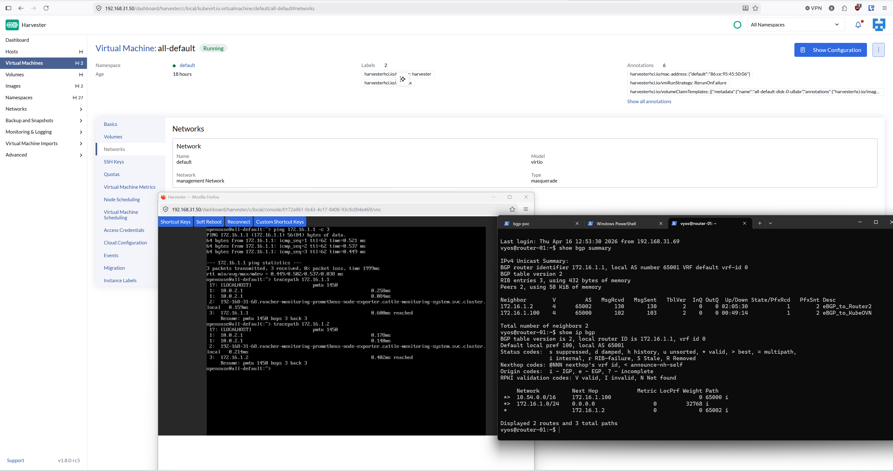

# VyOS BGP + Kube-OVN Lab on Hyper-V

> Validate BGP route propagation between VyOS routers and Kube-OVN in a Harvester cluster, running on Hyper-V.

## Overview

This lab builds a 3-node BGP mesh:

- **router-01** (VyOS, AS 65001) - eBGP peer to router-02 and Harvester
- **router-02** (VyOS, AS 65002) - eBGP peer to router-01, learns Kube-OVN routes via router-01
- **hv-01** (Harvester, Kube-OVN BGP speaker, AS 65000) - peers with router-01, advertises pod/service CIDRs

All nodes run as Hyper-V VMs with two NICs each: one for management (DHCP) and one for BGP peering (static).

```
┌─────────────────────────────────────────────────────────────┐
│  Hyper-V Host                                               │
│                                                             │
│  ┌──────────────┐   eBGP 65001↔65002   ┌──────────────┐     │
│  │  router-01   │◄────────────────────►│  router-02   │     │
│  │  AS 65001    │                      │  AS 65002    │     │
│  │  172.16.1.1  │                      │  172.16.1.2  │     │
│  └──────┬───────┘                      └──────────────┘     │
│         │  eBGP                                             │
│         │  65001↔65000                                      │
│         │                                                   │
│         ▼          ┌──────────────┐                         │
│         └─────────►│  Harvester   │                         │
│                    │  Kube-OVN    │                         │
│                    │  AS 65000    │                         │
│                    │  172.16.1.100│                         │
│                    └──────────────┘                         │
│                                                             │
│  ┌─────────────────────┐  ┌─────────────────────┐           │
│  │  Local-Switch       │  │  BGP-Switch         │           │
│  │  192.168.x.x/24     │  │  172.16.1.0/24      │           │
│  │  DHCP · management  │  │  VLAN 100 · BGP peer│           │
│  └─────────────────────┘  └─────────────────────┘           │
└─────────────────────────────────────────────────────────────┘
```



## 1. Hyper-V setup

### VM specifications

| VM | vCPU | RAM | Disk | NIC 0 (eth0) | NIC 1 (eth1) |
|---|---|---|---|---|---|
| router-01 | 1 | 1–2 GB | 10–20 GB | Local-Switch (DHCP) | BGP-Switch (eth1 vif 100, 172.16.1.1/24) |
| router-02 | 1 | 1–2 GB | 10–20 GB | Local-Switch (DHCP) | BGP-Switch (eth1 vif 100, 172.16.1.2/24) |
| hv-01 | per cluster req. | per cluster req. | per cluster req. | Local-Switch (DHCP) | BGP-Switch (eth2, VLAN 100, 172.16.1.100/24) |

### Virtual switches

Create two Hyper-V virtual switches:

1. **Local-Switch** - `192.168.x.x/24`, DHCP, used for SSH management access.
2. **BGP-Switch** - `172.16.1.0/24`, VLAN 100 tagged, dedicated to BGP peering traffic. Do **not** set access-mode VLAN on individual VM ports - all endpoints handle 802.1Q tagging natively.

Attach both switches to every VM.

### VLAN trunk on VM adapters

Hyper-V drops 802.1Q tagged frames by default. Enable VLAN trunking on the BGP-Switch adapter for each VM (run on the Hyper-V host in PowerShell):

```powershell
Get-VMNetworkAdapter -VMName "router-01" | Where-Object { $_.SwitchName -eq "BGP-Switch" } | Set-VMNetworkAdapterVlan -Trunk -AllowedVlanIdList "100" -NativeVlanId 0

Get-VMNetworkAdapter -VMName "router-02" | Where-Object { $_.SwitchName -eq "BGP-Switch" } | Set-VMNetworkAdapterVlan -Trunk -AllowedVlanIdList "100" -NativeVlanId 0

Get-VMNetworkAdapter -VMName "hv-01" | Where-Object { $_.SwitchName -eq "BGP-Switch" } | Set-VMNetworkAdapterVlan -Trunk -AllowedVlanIdList "100" -NativeVlanId 0

# Harvester uses a bridge MAC (bgp-br) different from the VM adapter MAC.
# Hyper-V drops frames with mismatched source MACs unless spoofing is allowed.
Get-VMNetworkAdapter -VMName "hv-01" | Where-Object { $_.SwitchName -eq "BGP-Switch" } | Set-VMNetworkAdapter -MacAddressSpoofing On
```

Verify:

```powershell
Get-VMNetworkAdapterVlan -VMName * | Format-Table VMName, ParentAdapter, OperationMode, AllowedVlanIdList
```

## 2. VyOS configuration

> **Important**: The syntax below targets **VyOS 1.4.x (sagitta) and current**. The global AS is declared with `set protocols bgp system-as <ASN>` - there is no ASN in the tree path. `local-as` is a per-neighbor AS override for migration scenarios, not the global AS declaration. There is no `activate` keyword - address-family is enabled by declaring it under the neighbor.

### 2.1 Base networking

**Router1**

```bash
configure

set interfaces ethernet eth0 address dhcp
set interfaces ethernet eth0 description 'Management'
set interfaces ethernet eth1 vif 100 address 172.16.1.1/24
set interfaces ethernet eth1 vif 100 description 'BGP_Peering_VLAN100'
set service ssh port 22

commit
save
exit
```

**Router2**

```bash
configure

set interfaces ethernet eth0 address dhcp
set interfaces ethernet eth0 description 'Management'
set interfaces ethernet eth1 vif 100 address 172.16.1.2/24
set interfaces ethernet eth1 vif 100 description 'BGP_Peering_VLAN100'
set service ssh port 22

commit
save
exit
```

### 2.2 BGP peering

**Router1 (AS 65001)** - peers with Router2 AND Harvester:

```bash
configure

# Core BGP
set protocols bgp system-as 65001
set protocols bgp address-family ipv4-unicast network 172.16.1.0/24

# Peer: Router2
set protocols bgp neighbor 172.16.1.2 remote-as 65002
set protocols bgp neighbor 172.16.1.2 description 'eBGP_to_Router2'
set protocols bgp neighbor 172.16.1.2 update-source 172.16.1.1
set protocols bgp neighbor 172.16.1.2 address-family ipv4-unicast

# Peer: Harvester / Kube-OVN
set protocols bgp neighbor 172.16.1.100 remote-as 65000
set protocols bgp neighbor 172.16.1.100 description 'eBGP_to_KubeOVN'
set protocols bgp neighbor 172.16.1.100 update-source 172.16.1.1
set protocols bgp neighbor 172.16.1.100 address-family ipv4-unicast

commit
save
exit
```

**Router2 (AS 65002)** - peers with Router1 (Harvester peer config included; requires a second speaker instance to establish):

```bash
configure

# Core BGP
set protocols bgp system-as 65002
set protocols bgp address-family ipv4-unicast network 172.16.1.0/24

# Peer: Router1
set protocols bgp neighbor 172.16.1.1 remote-as 65001
set protocols bgp neighbor 172.16.1.1 description 'eBGP_to_Router1'
set protocols bgp neighbor 172.16.1.1 update-source 172.16.1.2
set protocols bgp neighbor 172.16.1.1 address-family ipv4-unicast

# Peer: Harvester / Kube-OVN
set protocols bgp neighbor 172.16.1.100 remote-as 65000
set protocols bgp neighbor 172.16.1.100 description 'eBGP_to_KubeOVN'
set protocols bgp neighbor 172.16.1.100 update-source 172.16.1.2
set protocols bgp neighbor 172.16.1.100 address-family ipv4-unicast

commit
save
exit
```

### 2.3 Optional: prefix-list filters

For more realistic validation, restrict accepted prefixes from Kube-OVN:

```bash
configure

# Only accept pod and service CIDRs from Kube-OVN
set policy prefix-list KUBEOVN-IN rule 10 action permit
set policy prefix-list KUBEOVN-IN rule 10 prefix 10.54.0.0/16
set policy prefix-list KUBEOVN-IN rule 10 le 24
set policy prefix-list KUBEOVN-IN rule 20 action permit
set policy prefix-list KUBEOVN-IN rule 20 prefix 10.96.0.0/12
set policy prefix-list KUBEOVN-IN rule 20 le 32
set policy prefix-list KUBEOVN-IN rule 100 action deny
set policy prefix-list KUBEOVN-IN rule 100 prefix 0.0.0.0/0
set policy prefix-list KUBEOVN-IN rule 100 le 32

# Apply to Kube-OVN neighbor (run on Router1; repeat equivalent on Router2)
set protocols bgp neighbor 172.16.1.100 address-family ipv4-unicast prefix-list import KUBEOVN-IN

commit
save
exit
```

### 2.4 Verification commands

```bash
# BGP session status (expect Established for all peers)
show bgp summary

# Detailed neighbor info
show bgp neighbors

# Full routing table (should show Kube-OVN prefixes via 172.16.1.100)
show ip route
show ip bgp

# Connectivity
ping 172.16.1.2    # Router1 -> Router2
ping 172.16.1.100  # Router  -> Harvester
```

## 3. Kube-OVN BGP on Harvester

### 3.1 Prerequisites

- Harvester cluster operational with Kube-OVN as CNI.
- `kubectl` configured and working.
- Harvester node has a static IP (`172.16.1.100`) on the BGP-Switch network via `HostNetworkConfig` CRD (see section 3.6).

### 3.2 Label BGP speaker nodes

```bash
kubectl label nodes hv-01 ovn.kubernetes.io/bgp=true
```

### 3.3 Deploy `kube-ovn-speaker` DaemonSet

The `BgpConf`/`BgpPeer` CRDs are not available in Harvester's bundled Kube-OVN v1.15.4. Use the `kube-ovn-speaker` DaemonSet instead - BGP peers are configured via container args. The upstream reference manifest is at [kubeovn/kube-ovn release-1.15 speaker.yaml](https://raw.githubusercontent.com/kubeovn/kube-ovn/release-1.15/yamls/speaker.yaml).

```yaml
kind: DaemonSet
apiVersion: apps/v1
metadata:
  name: kube-ovn-speaker
  namespace: kube-system
spec:
  selector:
    matchLabels:
      app: kube-ovn-speaker
  template:
    metadata:
      labels:
        app: kube-ovn-speaker
        component: network
        type: infra
    spec:
      tolerations:
        - operator: Exists
          effect: NoSchedule
      affinity:
        podAntiAffinity:
          requiredDuringSchedulingIgnoredDuringExecution:
            - labelSelector:
                matchLabels:
                  app: kube-ovn-speaker
              topologyKey: kubernetes.io/hostname
      priorityClassName: system-node-critical
      serviceAccountName: ovn
      automountServiceAccountToken: true
      hostNetwork: true
      containers:
        - name: kube-ovn-speaker
          image: "docker.io/kubeovn/kube-ovn:v1.15.4"
          imagePullPolicy: IfNotPresent
          command:
            - /kube-ovn/kube-ovn-speaker
          args:
            - --neighbor-address=172.16.1.1
            - --neighbor-as=65001
            - --cluster-as=65000
            - --announce-cluster-ip=true
            - --holdtime=90s
            - --graceful-restart=true
          env:
            - name: NODE_NAME
              valueFrom:
                fieldRef:
                  fieldPath: spec.nodeName
            - name: POD_IP
              valueFrom:
                fieldRef:
                  fieldPath: status.podIP
            - name: POD_IPS
              valueFrom:
                fieldRef:
                  fieldPath: status.podIPs
          resources:
            requests:
              cpu: 500m
              memory: 300Mi
          volumeMounts:
            - name: kube-ovn-log
              mountPath: /var/log/kube-ovn
      nodeSelector:
        kubernetes.io/os: "linux"
        ovn.kubernetes.io/bgp: "true"
      volumes:
        - name: kube-ovn-log
          hostPath:
            path: /var/log/kube-ovn
            type: DirectoryOrCreate
```

> **Note**: `--neighbor-as` accepts a single value (uint32). Since router-01 (AS 65001) and router-02 (AS 65002) have different ASNs, this speaker only peers with router-01. Router-02 learns Kube-OVN routes via its eBGP session with router-01. To add a direct Harvester→Router-02 peering, deploy a second speaker DaemonSet with `--neighbor-address=172.16.1.2 --neighbor-as=65002`.

```bash
kubectl apply -f speaker.yaml
kubectl -n kube-system get pods -l app=kube-ovn-speaker -o wide
```

### 3.4 Annotate subnets for BGP advertisement

```bash
# Advertise the default pod CIDR
kubectl annotate subnet ovn-default ovn.kubernetes.io/bgp=true

# Check subnets
kubectl get subnets.kubeovn.io
```

### 3.5 Advertised prefixes

Kube-OVN advertises routes based on its subnet configuration. Verify what's being announced:

```bash
# Check Kube-OVN controller logs for BGP activity
kubectl -n kube-system logs -l app=kube-ovn-controller | grep -i bgp

# Inspect OVN logical topology
kubectl -n kube-system exec -it deploy/kube-ovn-controller -- ovn-nbctl show

# List Kube-OVN subnets (these are candidate prefixes)
kubectl get subnets.kubeovn.io
```

Expected advertised prefixes:

| Prefix | Source |
|---|---|
| `10.54.0.0/16` | Pod CIDR - `ovn-default` subnet |
| `10.96.0.0/12` (default) | Service CIDR - join subnet |
| Custom VPC CIDRs | Any VPC subnets with BGP annotation |

### 3.6 Harvester networking - BGP interface setup

This section is a dependency for the speaker. Complete all steps before deploying the DaemonSet.

#### Step 1 - Hyper-V prerequisites (Windows host)

```powershell
# Verify BGP-Switch exists and hv-01 has an adapter on it
Get-VMSwitch -Name "BGP-Switch"
Get-VMNetworkAdapter -VMName "hv-01" | Where-Object SwitchName -eq "BGP-Switch"

# Confirm VLAN trunk and MAC spoofing
Get-VMNetworkAdapterVlan -VMName "hv-01"
Get-VMNetworkAdapter -VMName "hv-01" | Select-Object Name, MacAddressSpoofing

# If not already configured:
# Get-VMNetworkAdapter -VMName "hv-01" | Where-Object { $_.SwitchName -eq "BGP-Switch" } | Set-VMNetworkAdapterVlan -Trunk -AllowedVlanIdList "100" -NativeVlanId 0
# Get-VMNetworkAdapter -VMName "hv-01" | Where-Object { $_.SwitchName -eq "BGP-Switch" } | Set-VMNetworkAdapter -MacAddressSpoofing On
```

#### Step 2 - ClusterNetwork + VlanConfig

Harvester needs a named `ClusterNetwork` to represent the physical NIC (`eth2`) and a `VlanConfig` to bind it as the uplink. These are in `clusternetwork.yaml` and `vlanconfig.yaml`:

```bash
kubectl apply -f clusternetwork.yaml
kubectl apply -f vlanconfig.yaml

# Wait for the ClusterNetwork to become ready (15–30 s)
kubectl get clusternetworks.network.harvesterhci.io bgp -w
```

Harvester creates the following network stack on top of `eth2` once the VlanConfig is applied:

```
eth2 (slave) → bgp-bo (bond) → bgp-br (bridge)
```

#### Step 3 - HostNetworkConfig (static IP assignment)

`hnc.yaml` assigns `172.16.1.100/24` on VLAN 100 via the `HostNetworkConfig` CRD. This is cluster-managed and survives reboots.

```bash
kubectl apply -f hnc.yaml

# Verify the IP is assigned
kubectl get hostnetworkconfig bgp-peering -o yaml   # check status.networkStatus
```

#### Step 4 - Verify L3 connectivity

**Blocker**: Do not proceed to section 3.2 until all pings succeed.

```bash
# On hv-01 - confirm IP is on the bridge
ip addr show bgp-br
# Expected: inet 172.16.1.100/24

# Ping both routers from hv-01
ping -c3 172.16.1.1   # router-01
ping -c3 172.16.1.2   # router-02

# From each VyOS router - verify reverse reachability
ping 172.16.1.100
```

## 4. Validation

### 4.1 End-to-end route check

```bash
# On Router1: confirm Kube-OVN prefixes appear
show ip bgp
# Expected: 10.54.0.0/16 via 172.16.1.100

# On Router2: confirm routes learned (directly or via Router1)
show ip bgp
```

### 4.2 Traffic test

```bash
# Deploy a test pod
kubectl run nginx --image=nginx -n default
kubectl expose pod nginx --port=80 --type=ClusterIP
kubectl get pods -o wide  # note the pod IP

# From Router1
ping <POD_IP>
traceroute <POD_IP>

# From Router2 (validates route propagation through the mesh)
ping <POD_IP>
traceroute <POD_IP>
```

### 4.3 VpcEgressGateway test (optional)

If testing per-tenant egress:

```bash
# Verify egress gateway pod has a route advertised
kubectl get vpcnatgateways.kubeovn.io -A
kubectl get vpcegressgateways.kubeovn.io -A

# From external router, check that the tenant's egress IP is reachable
# and that return traffic routes correctly through the gateway
```

## 5. Comparison with rrajendran17/KubeOVN-BGP

The [rrajendran17/KubeOVN-BGP](https://github.com/rrajendran17/KubeOVN-BGP) project demonstrates a similar Harvester-to-external-router BGP setup. Key differences:

| Aspect | This project | rrajendran17/KubeOVN-BGP |
|---|---|---|
| BGP speaker | `kube-ovn-speaker` DaemonSet (v1.15.4) | `kube-ovn-speaker` DaemonSet (v1.15.0) |
| Router software | VyOS (sagitta/current) | FRR |
| External routers | 2 (full eBGP mesh) | 1 |
| Peering network | Dedicated `172.16.1.0/24` vSwitch | Shared `192.168.x.x` management network |
| Advertised prefixes | Default pod/service CIDRs (automatic) | Custom VPC subnet via dummy interface + annotation |
| ASNs | 65000, 65001, 65002 | 65000, 65010 |
| Prefix filtering | Optional `KUBEOVN-IN` prefix-list on VyOS | FRR route-map `ACCEPT-ALL` |
| Ready-to-apply manifests | Yes (`speaker.yaml`, `hnc.yaml`) | Yes (`speaker.yaml`, `subnetbgp.yaml`, `vpcbgp.yaml`, etc.) |
| Provider network / VLAN | VLAN 100 via `HostNetworkConfig` + Hyper-V trunk | Included (`provider-network.yaml`, `untaggedvlan.yaml`) |

**Notable approach differences:**

- **Speaker model**: Both projects use `kube-ovn-speaker` as a DaemonSet selected by `ovn.kubernetes.io/bgp=true` node label.
- **Route advertisement**: `rrajendran17` uses explicit `ovn.kubernetes.io/bgp=true` annotations on pods and subnets plus a dummy interface (`ens7`) with a custom VPC CIDR (`172.50.10.0/24`). This project annotates the `ovn-default` subnet to advertise the pod CIDR (`10.54.0.0/16`).
- **Network isolation**: This project uses a dedicated BGP-Switch vSwitch separated from management traffic. `rrajendran17` peers over the management network.
- **Redundancy**: This project validates dual-router route propagation. `rrajendran17` is single-router with no transit path validation.

## 6. Troubleshooting

| Symptom | Investigation |
|---|---|
| BGP session stuck in `Idle` | Check IP reachability (`ping`), port 179 (`tcpdump -i eth1.100 port 179`), AS number mismatch, firewall rules |
| Session `Active` but not `Established` | Usually a TCP connection issue - check `update-source` matches the local eth1 IP |
| No routes from Kube-OVN | Verify speaker pod is running (`kubectl -n kube-system get pods -l app=kube-ovn-speaker`), check logs, verify subnet annotation `ovn.kubernetes.io/bgp=true` |
| Routes on Router1 but not Router2 | Missing eBGP peering between Router2 and Harvester, or eBGP next-hop issue between routers |
| Pod IP unreachable from router | Check Kube-OVN OVS flows, verify the logical router has a route back to 172.16.1.0/24 |
| Harvester node IP unreachable | Verify `HostNetworkConfig` status - `kubectl get hostnetworkconfig bgp-peering -o yaml` |
| Kube-OVN controller crash-looping | `kubectl -n kube-system logs -l app=kube-ovn-controller --previous` |
